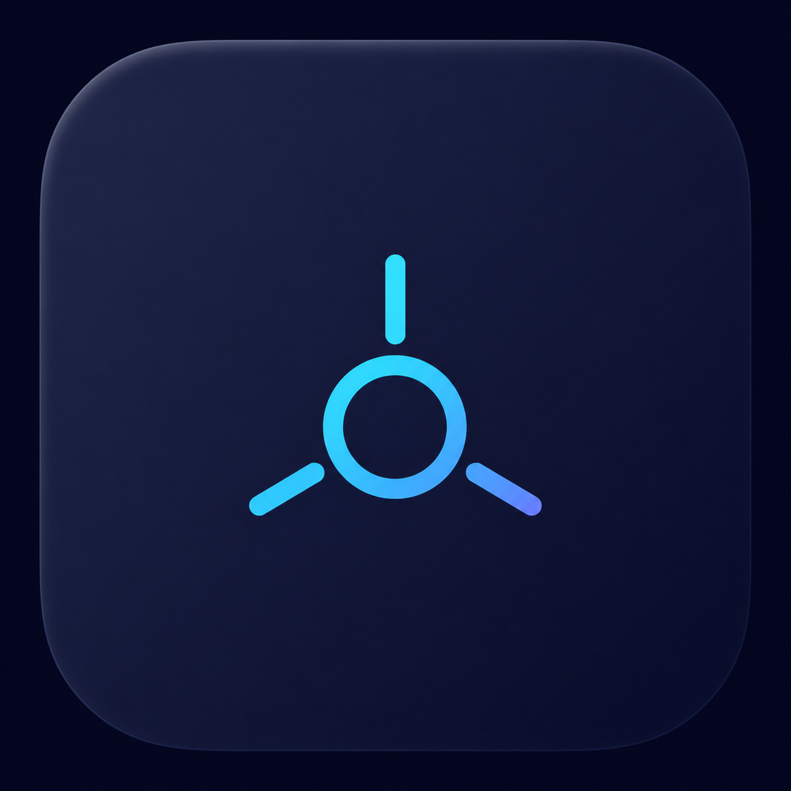

# RelayDock

RelayDock is a native macOS launcher and endpoint bridge project for AI coding tools.



Version 0.1.0 is intentionally a **Probe MVP**. It answers one important question safely: does Cursor's Anthropic BYOK traffic connect directly from the Mac to `api.anthropic.com`, or is it relayed through Cursor's backend? It does not yet redirect or decrypt Anthropic traffic.

## Current MVP

- Native SwiftUI window and menu bar utility.
- Sub2API endpoint profile with API keys stored in macOS Keychain.
- Endpoint health check through `GET /v1/models`.
- Local HTTP CONNECT probe bound to `127.0.0.1` on a random port.
- Cursor launcher using an app-scoped `--proxy-server` argument.
- Domain-only connection diagnostics; TLS payloads remain encrypted.
- One-click removal of RelayDock settings and Keychain credentials.
- No system proxy changes, root certificate installation, or HTTPS decryption in this milestone.

## Build

Requirements: macOS 13+, Xcode 16+ or a compatible Swift 6 toolchain.

Release builds are Universal 2 binaries for Apple Silicon and Intel Macs.

```bash
swift test
./scripts/build-app.sh
open dist/RelayDock.app
```

During development, you can also run:

```bash
swift run RelayDock
```

## Installer packages

Create both a drag-to-install DMG and a flat macOS installer package:

```bash
./scripts/package-release.sh
```

Artifacts are written to `dist/`:

- `RelayDock-<version>.dmg`
- `RelayDock-<version>.pkg`
- `SHA256SUMS`

The DMG contains:

- `安装说明.html`, with a step-by-step Chinese install and probe guide.
- `Install RelayDock.command`, which copies the app to `/Applications`, removes
  the quarantine attribute from that local copy, and applies an ad-hoc local
  signature.
- `Uninstall RelayDock.command`, which removes the app, RelayDock preferences,
  and the gateway API key stored in Keychain.

For an unsigned personal build, right-click `Install RelayDock.command`, choose
**Open**, and confirm the Terminal prompt. This avoids requiring users to type
the `codesign` command manually.

Local builds are ad-hoc app signed and the PKG is unsigned unless signing
identities are supplied:

```bash
RELAYDOCK_APP_SIGN_IDENTITY="Developer ID Application: Example" \
RELAYDOCK_INSTALLER_SIGN_IDENTITY="Developer ID Installer: Example" \
./scripts/package-release.sh
```

Public distribution without Gatekeeper warnings additionally requires Apple
Developer ID certificates and notarization.

## Probe workflow

1. Open RelayDock and start the probe proxy.
2. Fully quit any existing Cursor process.
3. Click **Launch Cursor through proxy**.
4. Configure Anthropic BYOK in Cursor and send one request.
5. Look for `api.anthropic.com` in RelayDock diagnostics.

If a direct Anthropic connection is observed, the next milestone can add a narrowly scoped TLS bridge for that host. If only Cursor backend domains appear, local endpoint substitution cannot be done transparently.

## Security model

- The proxy listens on loopback only.
- Remote gateway profiles require HTTPS; plain HTTP is accepted only for loopback gateways.
- Non-target connections are tunneled byte-for-byte.
- The probe stores no request bodies, headers, prompts, or responses.
- Gateway keys are stored with `kSecAttrAccessibleAfterFirstUnlockThisDeviceOnly`.
- RelayDock currently installs no certificates or privileged helpers.

## License

MIT. See [LICENSE](LICENSE).
